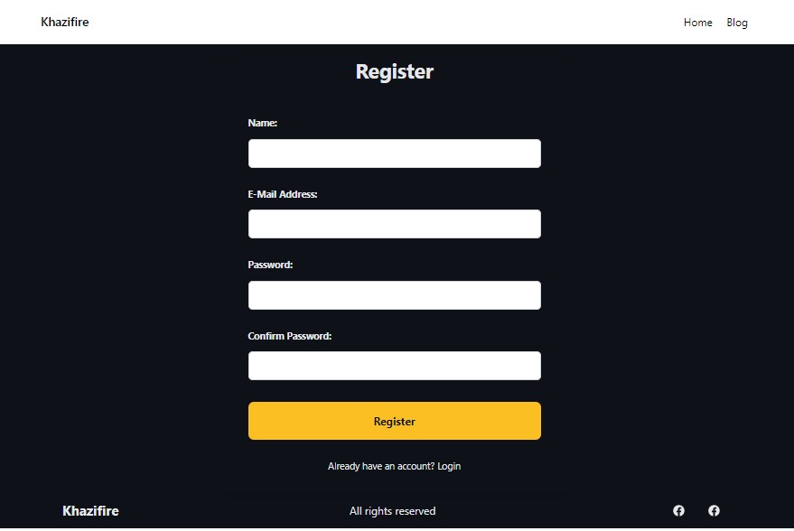
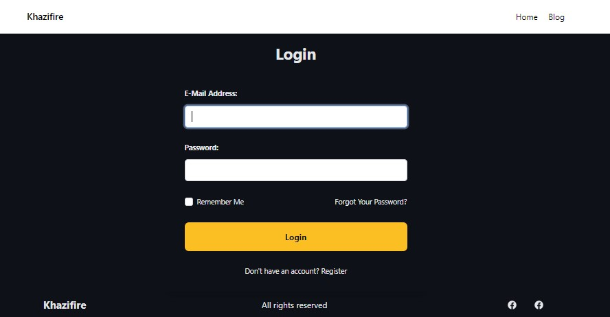
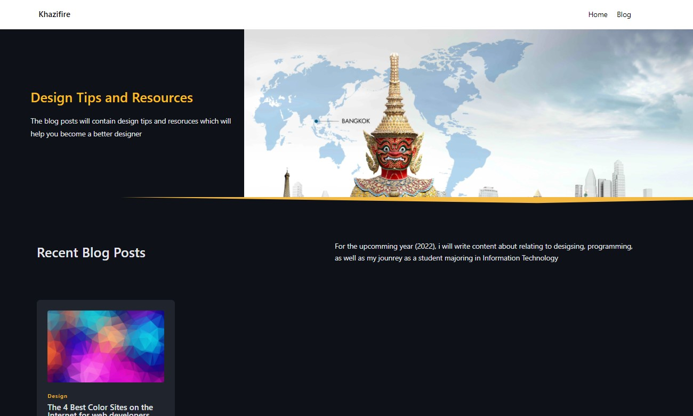
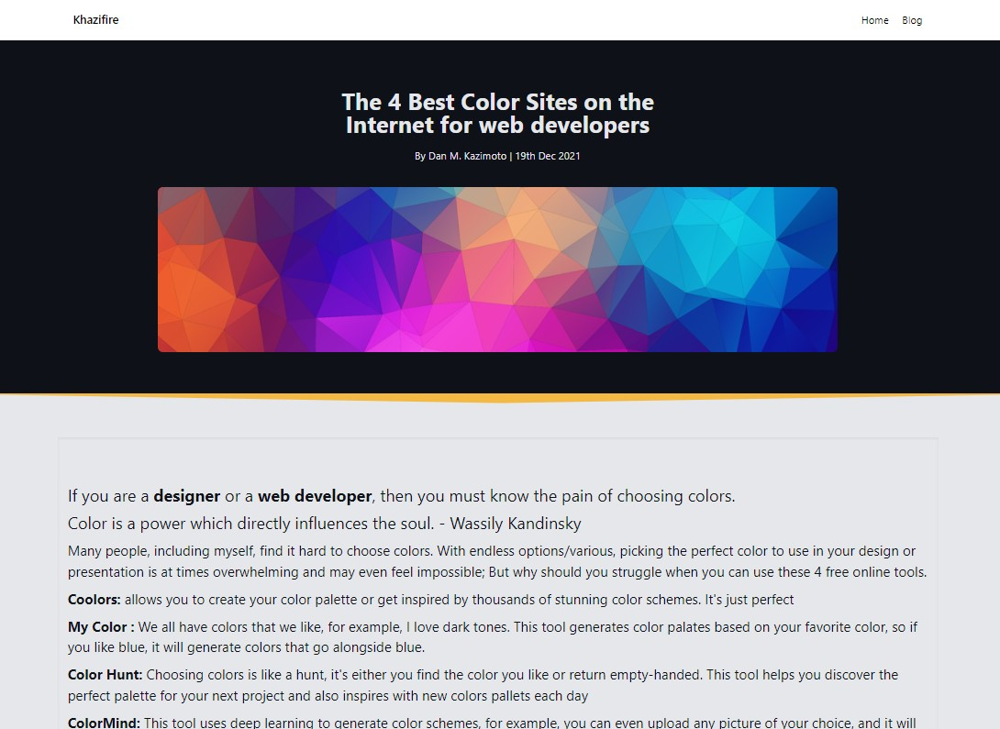

# Portfolio + Blog CMS
### This projects consists of a blog content management system integrated within my portfolio website. 

## Features

- Facilitates creating, updating, and deleting posts

- Enables a user to create a post in markdown format, which is then rendered as normal Html on the frontend.

- Allows users to create accounts, which can then be used to manage their posts. This being a personal project, i did not add a feature to allow users to manage their account since this will be be used by me.

## Technology Stack
```
- Frontend: TailwindCss
- Backend: PHP Laravel
    - Database: MySQL
    - Mardown Converter: erusev/parsedown
- Hosting: Hostinger
```
## Demo
for the sake of demonstration, i have created a feature to allow other users to create their accounts
- [create demo account: khazifire.com/register](https://khazifire.com/register)  (auto login after registration, and upon login you will be able to see the blog post created by others, but cannot edit nor delete them)

- [login: khazifire.com/login](https://khazifire.com/register)


## Some Screenshots
Register
<br>

<br>
Login
<br>

<br>
Blog Posts page
<br>

<br>
Blog Posts (markdown converted to html)
<br>

<br>
Creating/updating Blog Posts (markdown)
<br>

<br>


